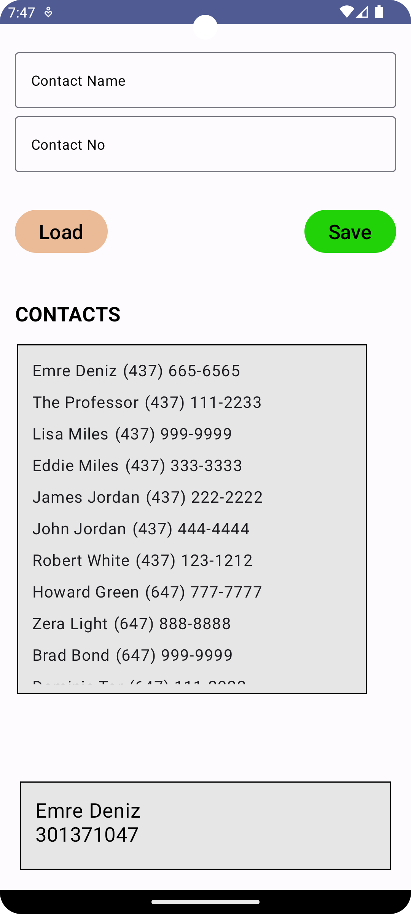

 # Android-ContentProvider-ManageContacts
Manage contacts with ContentProvider in Android Kotlin Application

### HOW TO RUN:
```console
Open project in Android Studio
Run on Virtual or Physical Device
```

### FEATURES:
1. **Load** contacts from Contacts app
2. **Save** a contact to Contacts app

### SCREENSHOTS:
<kbd></kbd>
